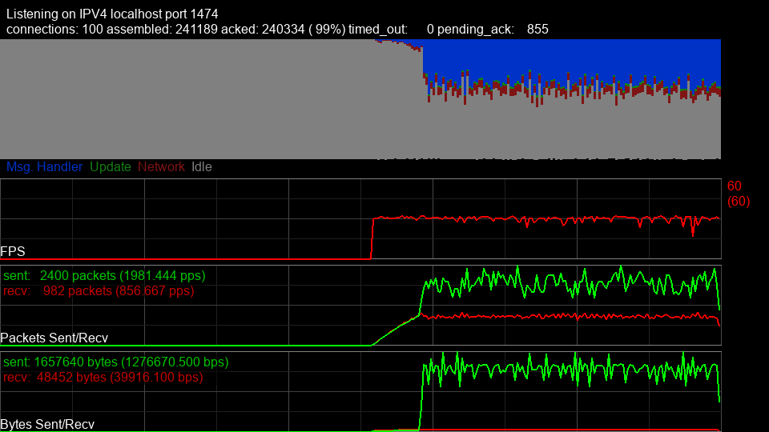

[Home](../README.md)

* [Echo Server Example](./example.md)
* [PyGame Example](docs/example2.md)
* [Getting Started](./GettingStarted.md)
* [Production Deployment](./ProductionDeployment.md)

# Example 2 - Multi-player Asteroids

This is a complete example of a multi-player game which utilizes techniques for lag compensation and server side collision detection.

In this example a version of Asteroids is implemented. Players can control their ship with the arrow keys.
The Up and Down keys increase or decrease forward thrust, while Left and Right keys rotate the ship.
Press space to charge and release space to fire a bullet.

This demonstrates how complex behaviors can be modeled and synchronized over a network.
Each ship can move in a complicated way as various effects such as thrust, drag, rotation effect the ship.
The position of the ship can change rapidly, in seemingly unpredictable ways and even wrap around the edge of the screen.
However, only the current position and rotation are needed to be sent over the network.
The game is synchronized by interpolating the ship state between successive updates.

The game is split into three files, the client and server with common code in a third file. These will be explained in more detail below.

[Client](../demo/tankclient.py)
[Server](../demo/tankserver.py)
[Common](../demo/tankcommon.py)

## Running the Demo

In one terminal run the following to start the server:

```bash
python -m demo.shipserver --gui
```

In a seperate terminal run the following to start a client:

```bash
python -m demo.shipclient
```

## Client


> :warning: wip

## Server



> :warning: wip

## Common

> :warning: wip

## Headless Client

> :warning: wip

A headless client is included to simulate a large number of client connections.

The normal test set up is to have three machines on the same network.
One machine runs the server while the other two machines run the headless client.
When running the client and server on the same instance the network card tends
to saturate and latency and timeouts increase dramatically.

With this set up, both client can be configured to run 50 connections.

The server is able to handle 100 connections with about 150 ms latency, with
about 1/3 idle time per tick.


```bash
python -m demo.headlessclient -n 50
```